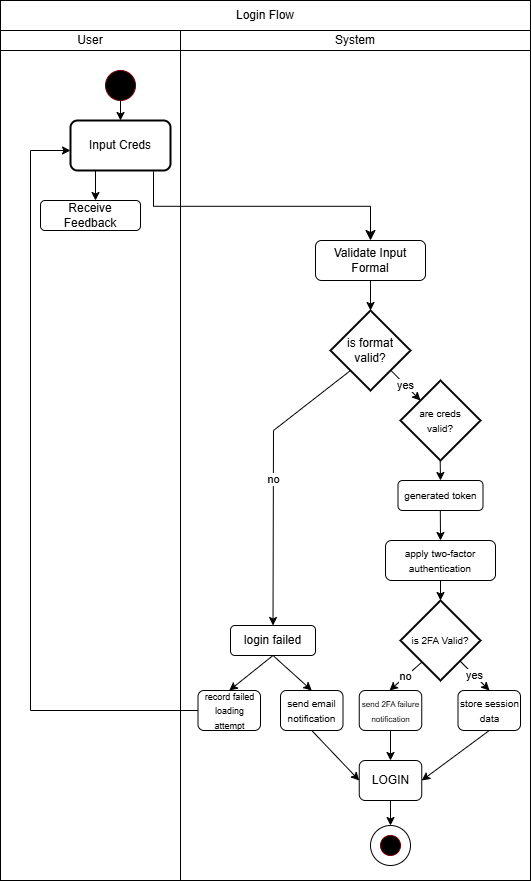
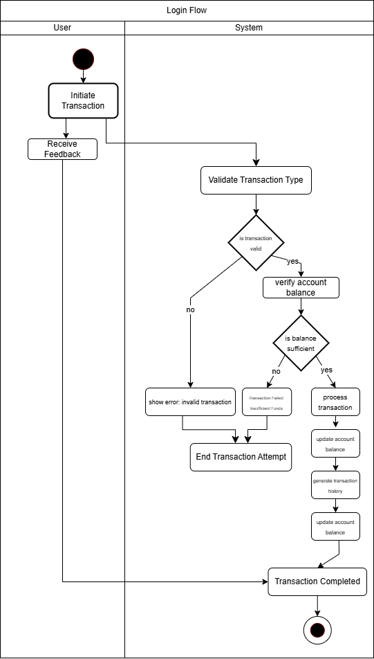

<<<<<<< HEAD
# RevoBank API
(BELOM DEPLOY API YA, NANTI AJA)

## Overview of the API
RevoBank API is a RESTful API built with Flask that implements core banking features for User Management, Account Management, and Transaction Management. This API serves as the backend for the RevoBank application.

## Features Implemented
1. User Management
   - Create new user account
   - Retrieve user profile
   - Update user profile

2. Account Management
   - Create new bank account
   - Retrieve account details
   - Update account information
   - List all accounts
   - Delete account

3. Transaction Management
   - Create transactions (deposit, withdrawal, transfer)
   - Retrieve transaction details
   - List all transactions
   - Filter transactions by account

## Installation and Setup Instructions
1. Clone the repository
```bash
git clone [repository-url]
cd revobank-api
```

2. Create and activate virtual environment
```bash
uv venv
.venv\Scripts\activate  # Windows
source .venv/bin/activate  # Linux/Mac
```

3. Install dependencies
```bash
uv pip install -r requirements.txt
```

4. Run the application
```bash
python main.py
```

The API will be available at `http://localhost:5000`

## API Usage Documentation

### Request & Response Examples

#### 1. Create User
POST /users
Request:
{
"username": "riotionalism",
"email": "fytrioamando@gmail.com",
"password": "rahasia"
}
Response: 201 Created
{
"message": "User created successfully",
"data": {
"id": 1,
"username": "riotionalism",
"email": "fytrioamando@gmail.com"
}
}

#### 2. Create Account
POST /accounts
Request:
{
"account_type": "savings",
"user_id": 1
}
Response: 201 Created
{
"message": "Account created successfully",
"data": {
"id": 1,
"account_type": "savings",
"user_id": 1
}
}


#### 3. Create Transaction
POST /transactions
Request:
{
"type": "deposit",
"amount": 1000,
"to_account": 1
}
Response: 201 Created
{
"message": "Transaction completed successfully",
"data": {
"id": 1,
"type": "deposit",
"amount": 1000,
"timestamp": "2024-03-14T10:30:00"
}
}


### Error Response Format
400 Bad Request
{
"error": "Missing required fields"
}
404 Not Found
{
"error": "Resource not found"
}

##
TENGKYU, THAT'S ALL!. LOVE U
=======
# 📌 Activity Diagrams  

Dokumen ini berisi diagram aktivitas yang menggambarkan dua proses utama dalam pengembangan backend.  
1. **User Authentication** 🔐  
2. **Transaction Handling** 💰  

Diagram ini dibuat menggunakan **Draw.io** dan bertujuan untuk memberikan gambaran alur kerja sistem yang akan diimplementasikan.

---

## 📖 1. User Authentication  

Diagram ini menggambarkan alur login pengguna, mulai dari **input kredensial**, **validasi**, hingga **autentikasi dua faktor (2FA) jika diperlukan**.  

### 🔍 **Komponen dalam Diagram**  
| **Komponen** | **Penjelasan** |
| --- | --- |
| 🧑 **User** | Pengguna yang memasukkan kredensial login |
| 📩 **Input Credentials** | Pengguna memasukkan username dan password |
| 🔎 **Validate Input Format** | Sistem memeriksa apakah format input sudah benar |
| 🔄 **Check Credentials in Database** | Sistem membandingkan kredensial dengan data di database |
| ❌ **Login Failed** | Jika kredensial salah, login gagal |
| ✅ **Generate Token** | Jika sukses, sistem membuat token untuk autentikasi |
| 🔐 **Two-Factor Authentication (Optional)** | Jika diaktifkan, pengguna harus memasukkan kode OTP |
| 🔔 **Send Email Notification** | Notifikasi dikirim saat ada percobaan login gagal |
| 📁 **Store Session Data** | Data sesi disimpan setelah login berhasil |

---

## 💸 2. Transaction Handling  

Diagram ini menggambarkan bagaimana sistem menangani transaksi seperti **deposit, withdraw, dan transfer**.  

### 🔍 **Komponen dalam Diagram**  
| **Komponen** |**Penjelasan** |
| --- | --- |
| 🧑 **User** | Aktor yang memulai transaksi |
| 🏦 **Initiate Transaction** | Pengguna memilih jenis transaksi |
| 🔄 **Validate Transaction** | Sistem memeriksa apakah transaksi valid |
| 💰 **Check Balance** | Pengecekan saldo sebelum transaksi dilakukan |
| ❌ **Is Balance Sufficient?** | Jika saldo tidak cukup, transaksi gagal |
| ✅ **Process Transaction** | Jika saldo cukup, transaksi diproses |
| 📝 **Generate Transaction History** | Catatan transaksi dibuat di database |
| 📧 **Send Confirmation Email** | Notifikasi transaksi dikirim ke pengguna |

---

## 📌 Kesimpulan  

Dah lah gitu aja.

## 🖼️ Diagram Screenshots  

### 🔐 User Authentication  
  

### 💸 Transaction Handling  

>>>>>>> 03c222b6bf265392554bef113191b343662ce9f4
