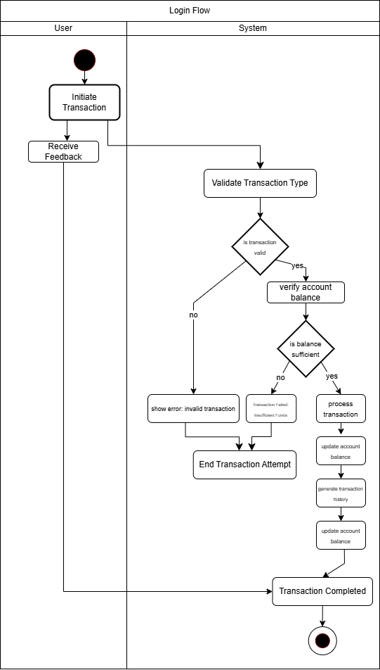

# 📌 Activity Diagrams  

Dokumen ini berisi diagram aktivitas yang menggambarkan dua proses utama dalam pengembangan backend.  
1. **User Authentication** 🔐  
2. **Transaction Handling** 💰  

Diagram ini dibuat menggunakan **Draw.io** dan bertujuan untuk memberikan gambaran alur kerja sistem yang akan diimplementasikan.

---

## 📖 1. User Authentication  

Diagram ini menggambarkan alur login pengguna, mulai dari **input kredensial**, **validasi**, hingga **autentikasi dua faktor (2FA) jika diperlukan**.  

### 🔍 **Komponen dalam Diagram**  
| **Komponen** | **Penjelasan** |
| --- | --- |
| 🧑 **User** | Pengguna yang memasukkan kredensial login |
| 📩 **Input Credentials** | Pengguna memasukkan username dan password |
| 🔎 **Validate Input Format** | Sistem memeriksa apakah format input sudah benar |
| 🔄 **Check Credentials in Database** | Sistem membandingkan kredensial dengan data di database |
| ❌ **Login Failed** | Jika kredensial salah, login gagal |
| ✅ **Generate Token** | Jika sukses, sistem membuat token untuk autentikasi |
| 🔐 **Two-Factor Authentication (Optional)** | Jika diaktifkan, pengguna harus memasukkan kode OTP |
| 🔔 **Send Email Notification** | Notifikasi dikirim saat ada percobaan login gagal |
| 📁 **Store Session Data** | Data sesi disimpan setelah login berhasil |

---

## 💸 2. Transaction Handling  

Diagram ini menggambarkan bagaimana sistem menangani transaksi seperti **deposit, withdraw, dan transfer**.  

### 🔍 **Komponen dalam Diagram**  
| **Komponen** |**Penjelasan** |
| --- | --- |
| 🧑 **User** | Aktor yang memulai transaksi |
| 🏦 **Initiate Transaction** | Pengguna memilih jenis transaksi |
| 🔄 **Validate Transaction** | Sistem memeriksa apakah transaksi valid |
| 💰 **Check Balance** | Pengecekan saldo sebelum transaksi dilakukan |
| ❌ **Is Balance Sufficient?** | Jika saldo tidak cukup, transaksi gagal |
| ✅ **Process Transaction** | Jika saldo cukup, transaksi diproses |
| 📝 **Generate Transaction History** | Catatan transaksi dibuat di database |
| 📧 **Send Confirmation Email** | Notifikasi transaksi dikirim ke pengguna |

---

## 📌 Kesimpulan  

Dah lah gitu aja.

## 🖼️ Diagram Screenshots  

### 🔐 User Authentication  
  

### 💸 Transaction Handling  
